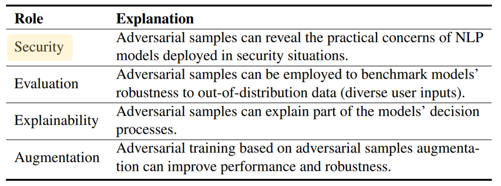

# Advbench

Code and data of the EMNLP 2022 paper **"Why Should Adversarial Perturbations be Imperceptible? Rethink the Research Paradigm in Adversarial NLP"**.

## Overview

Textual adversarial samples play important roles in multiple subfields of NLP research, including security, evaluation, explainability, and data augmentation.However, most work mixes all these roles, obscuring the problem definitions and research goals of the security role that aims to reveal the practical concerns of NLP models.
In this paper, we rethink the research paradigm of textual adversarial samples in security scenarios.
We discuss the deficiencies in previous work and propose our suggestions that the research on the **S**ecurity-**o**riented **ad**versarial **NLP (SoadNLP) should:**
(1) evaluate their methods on security tasks to demonstrate the real-world concerns;
(2) consider real-world attackers' goals, instead of developing impractical methods. 
To this end, we first collect, process, and release a security datasets collection **advbench**. Then, we reformalize the task and adjust the emphasis on different goals in SoadNLP. Next, we propose a simple method based on heuristic rules that can easily fulfill the actual adversarial goals to simulate real-world attack methods.We conduct experiments on both the attack and the defense sides on Advbenchmark. 
Experimental results show that our method has higher practical value, indicating that the research paradigm in SoadNLP may start from our new benchmark.



## Dependencies

```
pip install -r requirements.txt
```

Maybe you need to change the version of some libraries depending on your servers.

## Data Preparation

You need to download the data from Google Drive[[data](https://drive.google.com/drive/folders/1_2q2282ZEoE_iPg8Q4ILGeB_aAkcP43v?usp=sharing)] and save them into  `/data`.  

We provide the original dataset (ori_dataset), the processed dataset (rel_dataset) and the experimental dataset (exp_dataset). If you just want to reproduce the experiment, just download the exp_dataset. If you want to use our benchmark for further research, please download rel_dataset.

## Experiments

First, you should fine-tune the pre-trained model on our  security datasets collection **Advbench**.

```
train.sh
```

Then, to conduct the baseline attack experiments via our settings:

```
base_attack.sh
```

To conduct attack experiments via ROCKET:

```
rocket.sh
```

## Citation

